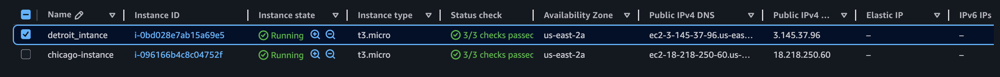
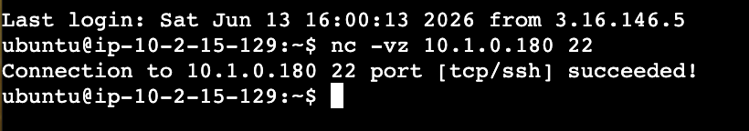

# AWS VPC Peering Between Two VPCs

## Project Overview

This project demonstrates the implementation and validation of AWS VPC Peering to enable secure private communication between EC2 instances located in separate Virtual Private Clouds (VPCs). The solution allows resources to communicate over AWS's private network without traversing the public internet.

## Architecture

* VPC A: 10.1.0.0/16
* VPC B: 10.2.0.0/16
* AWS VPC Peering Connection
* EC2 Instance in each VPC
* Route Tables configured for cross-VPC communication
* Security Groups configured for private access


## Key Features

* Established AWS VPC Peering between isolated VPCs
* Configured bidirectional routing through VPC route tables
* Implemented Security Group rules for secure communication
* Validated connectivity using private IP addresses
* Confirmed successful SSH communication across VPC boundaries
* Eliminated dependency on public internet connectivity

## Connectivity Validation

Successfully verified connectivity between EC2 instances using private IP addresses.

```bash
nc -zv IPV4 port 22.
nc -zv 10.2.15.129 22
Connection to 10.2.15.129 22 port [tcp/ssh] succeeded!
```


This confirmed:

* Active VPC Peering connection
* Correct route table configuration
* Security Group access control
* Private network communication between VPCs

## Technologies Used

* Amazon VPC
* VPC Peering
* Amazon EC2
* Route Tables
* Security Groups
* Linux (Ubuntu)
* SSH
* AWS Networking

## Learning Outcomes

Through this project, I gained hands-on experience with:

* AWS network architecture design
* VPC Peering implementation
* Route propagation and traffic flow analysis
* Security Group and NACL troubleshooting
* Private connectivity validation between cloud environments
* AWS networking best practices

## Future Enhancements

* Infrastructure as Code using Terraform
* Transit Gateway implementation
* Cross-Region VPC Peering
* Network monitoring with VPC Flow Logs
* Automated connectivity testing
